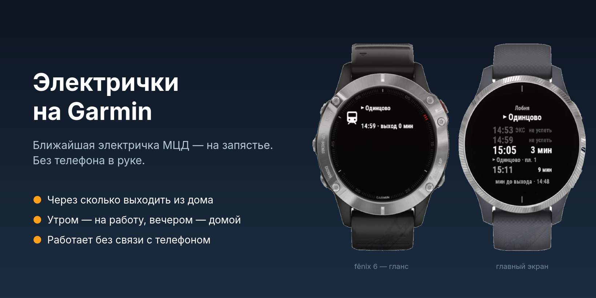
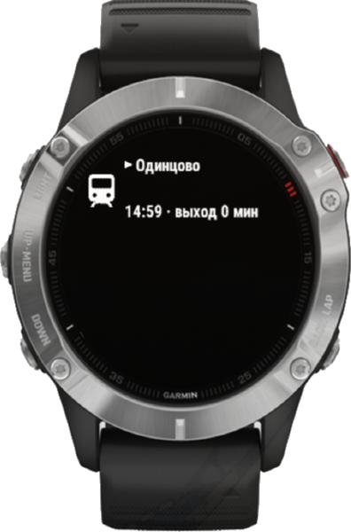
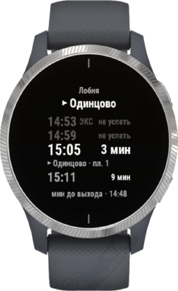

<div align="center">

# Электрички на Garmin

**Ближайшая электричка — на запястье. Без телефона в руке.**

Виджет для часов Garmin с расписанием МЦД и пригородных поездов Москвы:
куда идёт поезд, когда он уходит и через сколько минут вам выходить из дома.

[](https://github.com/andreiyurik/garmin-elektrichki/actions/workflows/proxy.yml)


[](LICENSE)



</div>

> **Статус: бета.** Приложение работает в симуляторе Connect IQ на тестовых
> данных; подключение к живому расписанию и проверка на часах — следующий шаг.
> В Connect IQ Store его пока нет.

## Проблема

Утро, вы бежите к станции. Чтобы узнать, успеваете ли на электричку, нужно
достать телефон, разблокировать его, открыть приложение, дождаться загрузки и
найти свой маршрут. Это 20–30 секунд — в перчатках, с сумкой, на ходу.

На часах Garmin, которые уже на руке, такой информации не было: в Connect IQ
Store нет ни одного приложения с расписанием электричек Москвы (поиск по
магазину, октябрь 2026).

## Решение

Поднимите руку — и сразу видно главное:

- **Куда и когда.** Гланс в ленте виджетов показывает ближайший поезд и минуты
  до него, ничего не нужно открывать.
- **Когда выходить.** Укажите дорогу до станции — и вместо «через 14 минут»
  виджет скажет **«выход через 4 мин»**. Поезда, на которые уже не успеть,
  становятся серыми, время «пора выходить» подсвечивается оранжевым.
- **Утром — на работу, вечером — домой.** Направление выбирается само по
  времени суток. Кнопка START разворачивает его.
- **Где садиться.** Для ближайшего поезда — конечная и платформа. Экспрессы
  помечены, их можно скрыть: на них нужен другой билет.
- **Работает без телефона.** Расписание на 3 дня хранится в часах и
  обновляется в фоне раз в час. Внизу экрана видно, когда оно загружено.
- **Честно о проблемах.** «Станция не найдена: …», «Нет связи с телефоном»,
  «по расписанию» — вместо пустого экрана или выдуманных данных.

## Скриншоты

<table>
  <tr>
    <td align="center" width="50%">
      <br>
      <b>Гланс на fēnix 6</b><br>
      Куда и через сколько выходить — прямо в ленте виджетов
    </td>
    <td align="center" width="50%">
      <br>
      <b>Главный экран</b><br>
      Серый — уже не успеть, крупно — ваш поезд, под ним конечная и платформа
    </td>
  </tr>
</table>

<sub>Снимки из симулятора Connect IQ SDK на тестовом расписании. Главный экран
показан на vívoactive 4 — у него такой же экран 260×260, как у fēnix 6.</sub>

## Как начать

1. Установите виджет на часы.
2. В приложении Garmin Connect: **Connect IQ → Электрички → Настройки**.
3. Укажите станции **«Дом»** и **«Работа»** — просто названием, например `Одинцово`.
4. Укажите **«Дорогу до станции»** в минутах.

Кнопки: **START** — развернуть направление, **MENU** (долгое нажатие UP) —
обновить расписание сейчас, **BACK** — выход, как в любом приложении Garmin.

## Как это устроено

```
[часы] ←Bluetooth→ [Garmin Connect на телефоне] → [Yandex Cloud Function] → [API Яндекс.Расписаний]
```

- **Часы** (`watch/`, Monkey C) — виджет с глансом. Фоновый сервис раз в час
  докачивает недостающие дни в `Application.Storage`; гланс и экран только
  читают сохранённое и не ходят в сеть.
- **Прокси** (`proxy/`, Node.js 22 в Yandex Cloud Functions) находит станцию по
  названию, забирает у Яндекса оба направления за день и отдаёт часам 1–2 КБ:
  каждый поезд — одно число. Так плотное расписание МЦД помещается в 32 КБ
  памяти гланса и быстро идёт по Bluetooth (400–800 байт/с по документации Garmin).

## Надёжность

- **По правилам Garmin.** Структура и механики взяты из официальной
  документации и примеров Connect IQ SDK (WebRequest, BackgroundTimer,
  ApplicationStorage, Menu2): родные меню и индикатор загрузки, системные
  шрифты, лимиты памяти и времени фоновых задач, UX Guidelines.
- **Тесты.** 22 юнит-теста часов (фреймворк Run No Evil, запускаются в
  симуляторе) и 8 тестов прокси; CI на каждый push. Логика получает текущее
  время параметром, поэтому полночь, последний поезд дня и устаревание кэша
  проверяются явно.
- **Защита от плохих данных.** Ответ сервера проверяется до сохранения;
  при ошибке остаётся последнее рабочее расписание.
- **Память измерена.** Гланс fēnix 6 на расписании с поездом каждые 6 минут
  (195 в каждую сторону) занимает 13,8 из 27,8 КБ.

## Устройства

| Устройство | Статус |
|---|---|
| fēnix 6 / 6S / 6 Pro / 6S Pro / 6X Pro | основная цель: сборка, юнит-тесты и гланс проверены в симуляторе |
| vívoactive 4 / 4S / 5 / 6 | собирается, экран проверен в симуляторе |

## Планы

### Версия 1.1 — вся Россия

- **Электрички по всей стране.** Санкт-Петербург, Екатеринбург, Казань, Нижний
  Новгород, Самара, Новосибирск и другие регионы, где Яндекс.Расписания
  публикуют пригородные поезда. Прокси уже умеет работать с любыми станциями —
  нужен общий справочник по всем регионам.
- **Одинаковые названия станций.** Подсказка направления или региона, например
  «Сокол (Савёловское)», чтобы найти именно вашу станцию.
- **Дополнительные маршруты.** До трёх избранных, например дача или родители, —
  в меню виджета.
- **Больше часов.** Forerunner 245/255/265/955/965, fēnix 7/8, epix, Venu,
  Instinct 2/3 с отдельной раскладкой для монохромного экрана.
- **Готовность к нагрузке.** Общий кэш ответов в Object Storage, чтобы тысячи
  пользователей укладывались в лимит API.
- **Публикация в Connect IQ Store** на русском и английском.

### Дальше

- Веб-страница настройки с поиском станций по первым буквам.
- Подсказка «успеешь шагом / бегом» по GPS.
- Задержки в реальном времени — если появится открытый источник.

## Разработка

Нужны [Connect IQ SDK](https://developer.garmin.com/connect-iq/sdk/) и файлы
устройств (SDK Manager → Devices).

```sh
./test.sh          # тесты прокси, строгая сборка под все устройства, юнит-тесты в симуляторе
./test.sh proxy    # только прокси (это же запускает GitHub Actions)
```

Запуск в симуляторе:

```sh
monkeyc -f watch/monkey.jungle -d fenix6 -o bin/app.prg -y ~/.Garmin/ConnectIQ/keys/developer_key.der -l 3
connectiq && monkeydo bin/app.prg fenix6
```

Прокси:

```sh
cd proxy
YANDEX_API_KEY=… npm run stations   # пересобрать src/stations.json
yc init                             # один раз
npm run deploy                      # создаёт публичную функцию и печатает её URL
```

Ключ API — на [developer.tech.yandex.ru](https://developer.tech.yandex.ru)
(«API Яндекс.Расписаний»); скрипт берёт его из `~/.config/mcd-garmin/yandex_key`.
URL функции задаётся свойством `ProxyUrl` в `watch/resources/settings/properties.xml`.
Иконка: `watch/art/launcher_icon.svg`, размеры под устройства —
`watch/art/build-icons.sh`.

Идеи интерфейса подсмотрены у [Avgånär](https://github.com/felwal/avganar)
(Стокгольм, GPL-3.0).

## Данные

Расписание предоставлено сервисом [Яндекс.Расписания](https://rasp.yandex.ru).

## Лицензия

[GPL-3.0](LICENSE)
